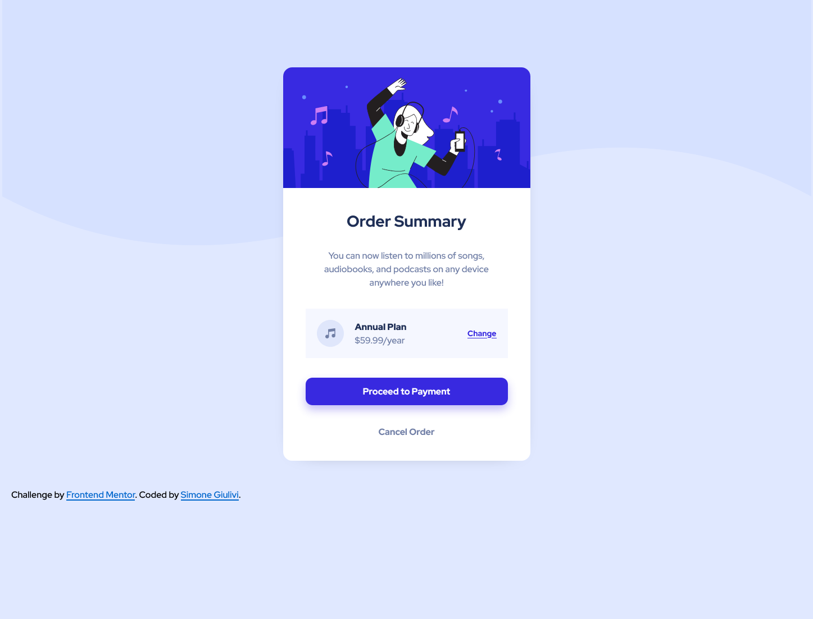

# Frontend Mentor - Order summary card solution

This is a solution to the [Order summary card challenge on Frontend Mentor](https://www.frontendmentor.io/challenges/order-summary-component-QlPmajDUj). Frontend Mentor challenges help you improve your coding skills by building realistic projects.

## Table of contents

- [The challenge](#the-challenge)
- [Screenshot](#screenshot)
- [Links](#links)
- [Author](#author)

### The challenge

Users should be able to:

- See hover states for interactive elements

### Screenshot

### Links

- Solution URL: https://github.com/Giulo25/Order-summary-component
- Live Site URL: https://giulo25.github.io/Order-summary-component/

## Author

- Website - [Simone Giulivi](https://www.simonegiulivi.com)
- Frontend Mentor - [@Giulo25](https://www.frontendmentor.io/profile/giulo25)
